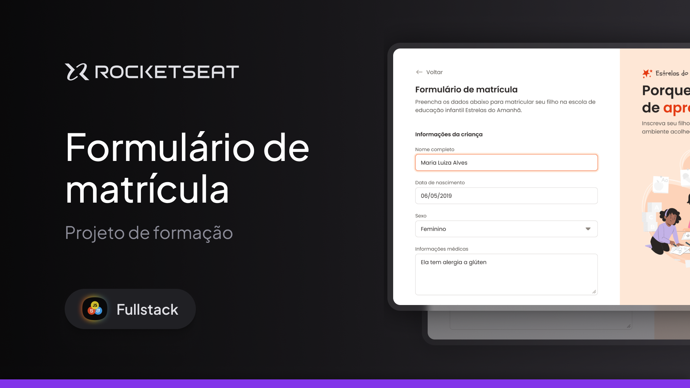

<h1 align="center"> Formulário de matrícula </h1>

Nesse projeto você vai desenvolver um formulário desktop para uma escola de educação infantil. 

  <a href="#-tecnologias">Tecnologias</a>&nbsp;&nbsp;&nbsp;|&nbsp;&nbsp;&nbsp;
  <a href="#-projeto">Projeto</a>&nbsp;&nbsp;&nbsp;|&nbsp;&nbsp;&nbsp;
  <a href="#-layout">Layout</a>&nbsp;&nbsp;&nbsp;|&nbsp;&nbsp;&nbsp;
  <a href="#memo-licença">Licença</a>

  

 

  

## 🚀 Tecnologias

Esse projeto foi desenvolvido com as seguintes tecnologias:

- HTML
- CSS
- Git
- Github
- Figma

## 💻 Projeto

Nesse projeto você vai desenvolver um formulário desktop para uma escola de educação infantil. O foco desse formulário é a aplicação da estruturação de formulário semântico, além de técnicas flex, grid entre outras de CSS.
 

Esse é um dos projetos desenvolvidos em aula na formação Full-Stack, um de nossos conteúdos de especialização.

## 🔖 Layout

Você pode visualizar o layout do projeto através [DESSE LINK](https://www.figma.com/community/file/1365016793556649696/formulario-de-matricula). É necessário ter conta no [Figma](https://figma.com) para acessá-lo.

## :memo: Licença

Esse projeto está sob a licença MIT.

---

Feito com ♥ by Rocketseat :wave: [Participe da nossa comunidade!](https://discord.gg/rocketseat)
